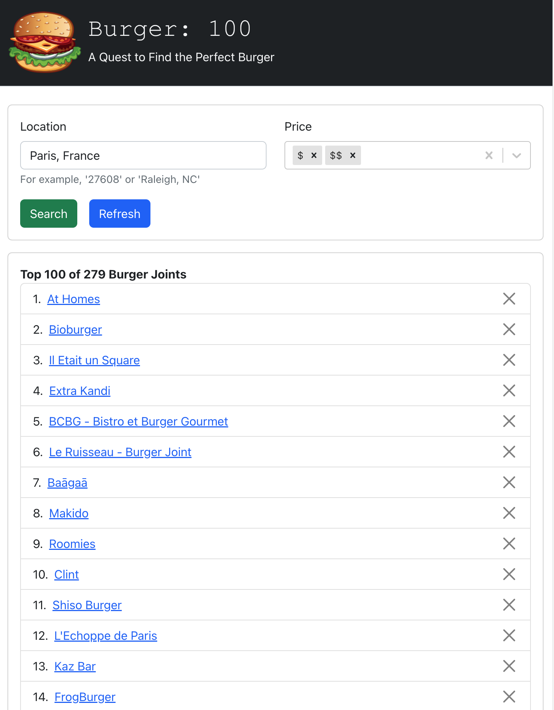

# Burger: 100
### Functionality
Whenever my spouse and I move to a new city, he wants to visit the top burger joints on a quest to find the perfect burger. This app organizes such a quest, with the following features:
- Lists the top 100 rated burger joints (data from Yelp)
- Persists the top 100. So, a user can delete "eliminated" burger joints from the list.
- Allows "refreshing"/"resetting" the data from Yelp, thus resetting the list back to it's original state.

I chose to combine the refresh/reset concepts (which could have been separate features) so that you can actually see a meaningful change of state when the data is refreshed.

## Install
```
brew tap mongodb/brew
brew install mongodb-community
brew services start mongodb-community
// In repo root directory
yarn install
cd client
yarn install
```

## Run
```
// In repo root directory
yarn start
```

## Tests
```
// In repo root directory
yarn test
```

## Screenshot

